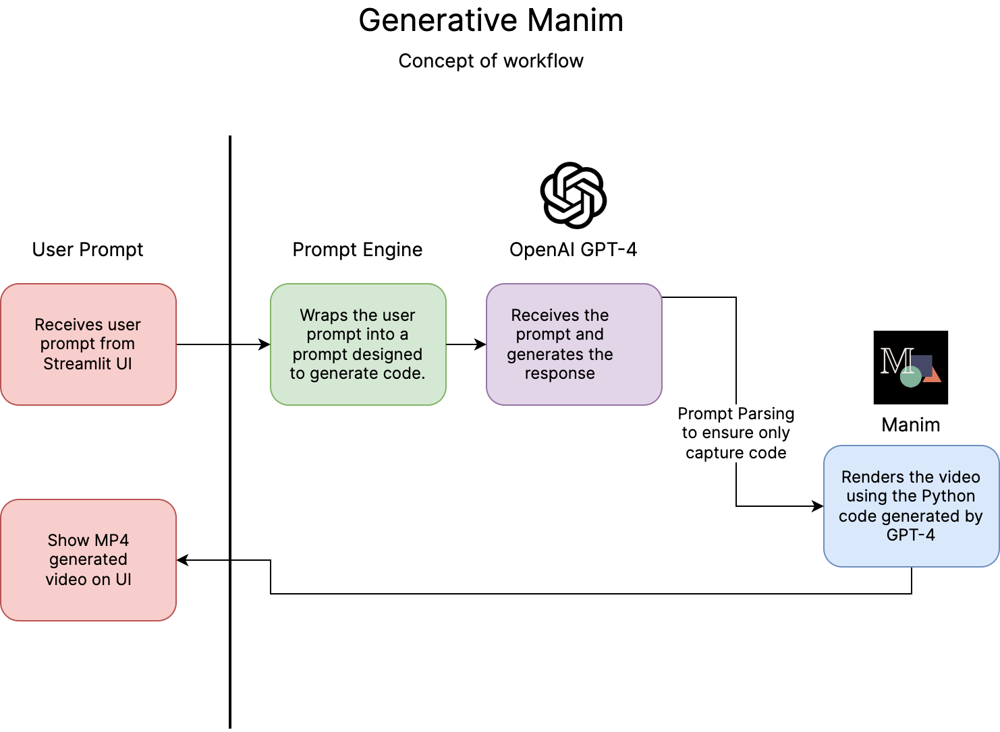

<p align="center">
  
  <h1 align="center">Generative Manim</h1>
</p>

<p align="center">
  🎨 GPT-4 powered generative videos. Concept. ⚡️
</p>


<p align="center">
  <a href="https://generative-manim.streamlit.app">
    
  </a>
  <a href="">
    
  </a>
</p>

---


## 🚀 Concept

Generative Manim is a prototype of a web app that uses [GPT-4](https://openai.com/research/gpt-4) to generate videos with [Manim](https://www.manim.community). The idea behind this project is taking advantage of the power of GPT-4 in programming, the understanding of human language and the animation capabilities of Manim to generate a tool that could be used by anyone to create videos. Regardless of their programming or video editing skills.

## 🛠 Core Development

Generative Manim is built with [Streamlit](https://streamlit.io). It uses [OpenAI API](https://platform.openai.com/docs/api-reference/introduction) to make requests to GPT-4 and GPT-3.5-turbo.



For more details, check out the [How it works](https://generative-manim.streamlit.app/%EF%B8%8F_How_it_works) section.

### 📦 Installation

Once you have cloned the repository, you need to install streamlit and set `OPENAI_API_KEY` as an environment variable in your system.

To start the app, run:

```
streamlit run src/main.py
```

## 🤲 Contributing

Generative Manim is an open source project.

If you want to be the author of a new feature, fix a bug or contribute with something new.

Fork the repository and make changes as you like. [Pull requests](https://github.com/360macky/project-name/pulls) are warmly welcome.
