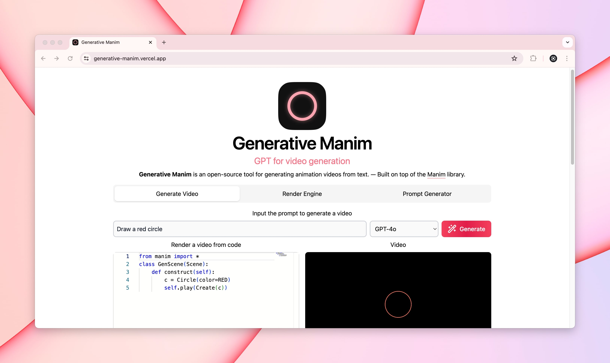

  
  <h1 align="center">Generative Manim</h1>

  🎨 GPT-4 powered generative videos. Concept. ⚡️ <a href="https://discord.gg/HkbYEGybGv">Join our Discord server here!</a>

  
  

---

## 🚀 Concept

**Generative Manim** (GM) is a suite of tools that allows you to create videos with Manim using LLMs (Large Language Models) like GPT-4 or Claude. The idea is to enable anyone to create wonderful animations from text ✨.

It began as a prototype of a web app that uses [GPT-4](https://openai.com/research/gpt-4) to generate videos with [Manim](https://www.manim.community). The idea behind this project is taking advantage of the power of LLMs in programming, the understanding of human language and the animation capabilities of Manim to generate a tool that could be used by anyone to create videos. Regardless of their programming or video editing skills.

- 🖐️ [Generative Manim Demo](https://generative-manim.vercel.app/): Check out the demo of Generative Manim!
- 🔬 [Generative Manim API](https://github.com/360macky/generative-manim/tree/main/api): Build over the Animation Processing Interface, or API.
- 🧑‍💻 [Generative Manim Developers](https://discord.gg/HkbYEGybGv): Join our Discord server, learn new things, share your creations and more!
- 🍎 [Generative Manim Streamlit (Legacy)](https://github.com/360macky/generative-manim/tree/main/streamlit): First LLM exploration of LLMs and Animation.

## 💻 Models

**Models** are the core of Generative Manim. A model is a way to convert text to code, that can later be rendered in a video.

| Name                          | Description                                                               | Engine                     | Phase |
| ----------------------------- | ------------------------------------------------------------------------- | -------------------------- | ----- |
| GM GPT-4o                     | Latest GPT model from OpenAI powered by a custom System Prompt            | GPT-4o                     | ✅    |
| GM GPT-3.5 Fine Tuned         | First Fine-tuned model of GPT-3.5                                         | GPT-3.5                    | ✅    |
| GM GPT-3.5 Physics Fine Tuned | Fine-tuned GPT-3.5 model trained to generate Physics animations           | GPT-3.5                    | ✅    |
| GM Claude Sonnet              | Claude Sonnet 3 model from Sonnet adapted with our custom System Prompt   | claude-3-sonnet-20240229   | ✅    |
| GM Claude Sonnet 3.5          | Claude Sonnet 3.5 model from Sonnet adapted with our custom System Prompt | claude-3-5-sonnet-20240620 | ✅    |

### 📡 New Models

If you want to suggest a new model, please open an issue in the [repository](https://github.com/360macky/generative-manim/issues) or talk with us in our [Discord server](https://discord.gg/HkbYEGybGv).

## ✨ Sponsors

**Generative Manim** is currently sponsored by **The Astronomical Software Company**.

## 🤲 Contributing

Generative Manim is an open source project.

If you want to be the author of a new feature, fix a bug or contribute with something new.

Fork the repository and make changes as you like. [Pull requests](https://github.com/360macky/generative-manim/pulls) are warmly welcome. Remember you can also join our [Discord server](https://discord.gg/HkbYEGybGv) to discuss new features, bugs or any other topic.
