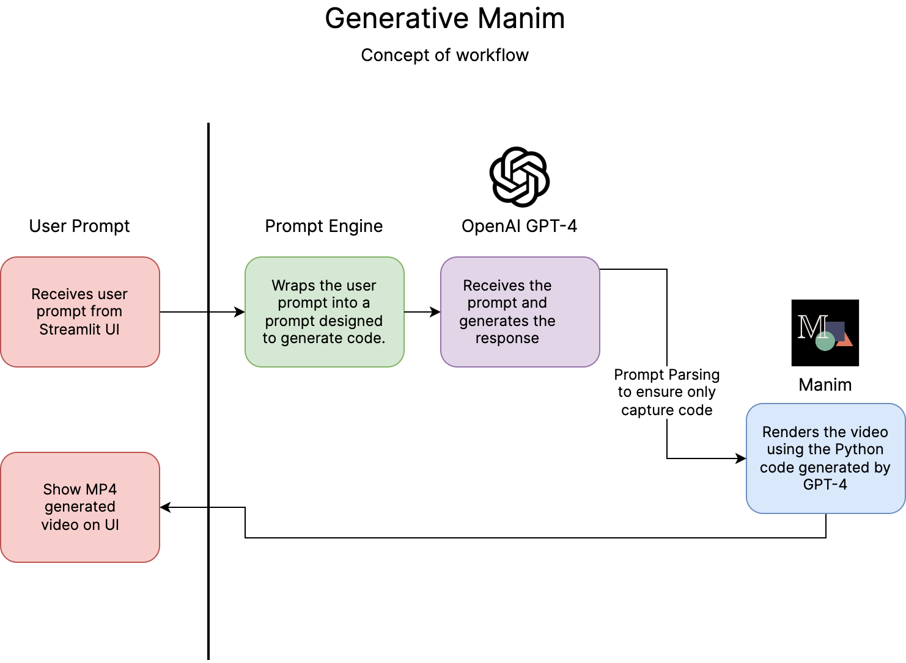

# Generative Manim Streamlit (Deprecated)

**Generative Manim** began as an experiment whose demo interface was in [Streamlit](https://streamlit.app/). Here you can find the source code that was used in that demo. The new demo is based on a web app with Next.js and you can find its source code at [360macky/generative-manim-demo](https://github.com/360macky/generative-manim-demo).

## Legacy Documentation

Generative Manim is built with [Streamlit](https://streamlit.io). It uses [OpenAI API](https://platform.openai.com/docs/api-reference/introduction) to make requests to GPT-4 and GPT-3.5-turbo.

For more details, check out the [How it works](https://generative-manim.streamlit.app/%EF%B8%8F_How_it_works) section.
